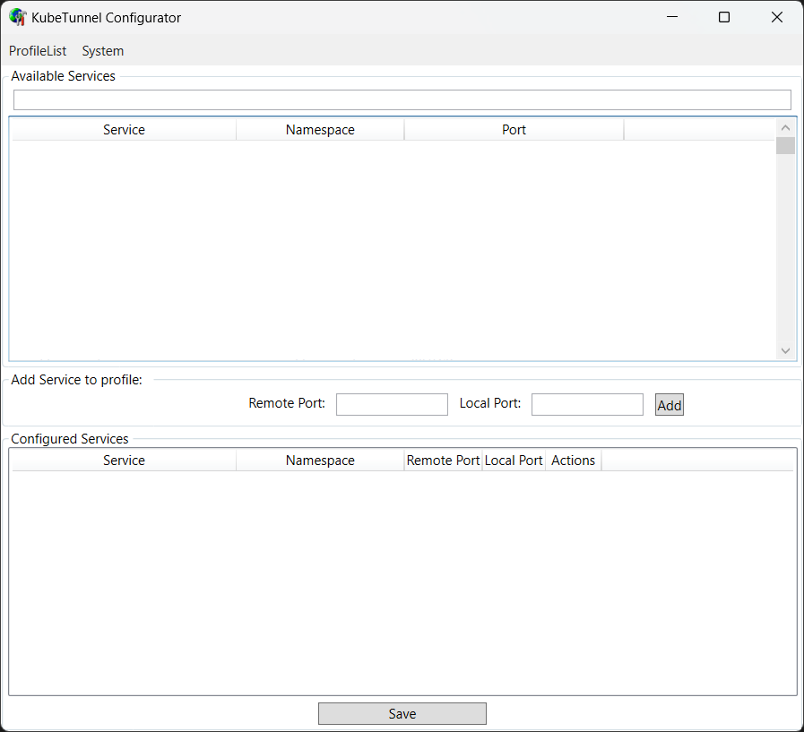

# kube-tunnel

`kube-tunnel` is a .NET application designed to simplify and streamline the process of creating secure tunnels to Kubernetes clusters. 
This tool helps developers and system administrators to securely access Kubernetes services and manage them with ease from remote locations.

## Features

- **Ease of Use**: Simplifies the process of setting up and managing port forwarding
- **Configuration Flexibility**: Offers customizable options for defining profiles for what services to port-forward

## Configuration tool

Select the service that you want to forward in the "Available Services" list and set the local port it should forward to.
 
The configured services show all that is configured for the current profile.

## Kube tunnel

This command line application will use the current profile to do port-forward for all the configured services.